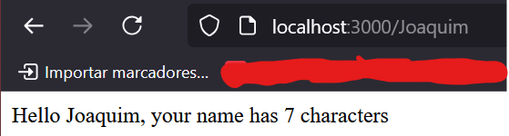
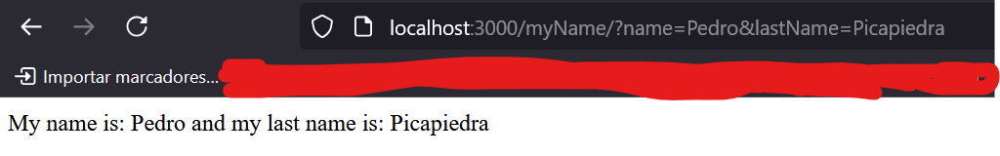

# Express - APIs

## ¿Que es Express?

Espress es un framework (_Marco de referencia_) backend de `Node.js`

No es comparable con frameworks de lado cliente como Angular o Vue. Se puede usar en combinación con estos frameworks para crear aplicaciones full stack completas.

## ¿Como instalar Express?

```bash
$ npm install express
```

## Empezando

Creamos un archivo llamado `index.js` y agragamos el siguiente código.

```js
const express = require("express");
const app = express();
const port = 3000;

app.get("/", (req, res) => {
    res.send("Hello World!");
});

app.listen(port, () => {
    console.log(`Example app listening on port ${port}`);
});
```

## Endpoints

El manejo de las requests/endpoints es simple:

-   `app.get()`
-   `app.post()`
-   `app.put()`
-   `app.delete()`

### Nuestro primer endpoint

```js
app.get("/", (req, res) => {
    res.send("Hello World!");
});
```

## Request

Pofundizando un poco más en Request, el métod que pasa toda la info. del navegador al servidor, podemos desde una peticion **REQUEST** hacernos llegar la info. de distinta manera:

-   **En la ruta** (req.params.nombreDelParametro)
    Es importante tener en cuenta que cuando utilizemos req.params accederemos al nommbre del parámetro que hemos definido antes en el endpoint:

```js
app.get("/:name", (req, res) => {
    res.send(
        `Hello ${req.params.name}, your name has ${req.params.name.length} characters`
    );
});
```



-   **Como Query String** (req.query.nombreQuery)
    Es importante tener en cuenta que cuando utilizemos `req.query` accederemos al nombre que hemos definido en la ruta:

```js
app.get("/myName", (req, res) => {
    res.send(
        "My name is: " +
            req.query.name +
            " and my last name is: " +
            req.query.lastName
    );
});
// localhost:3000/myName/?name=pedro&lastName=Picapiedra
```



-   **En el Body** (req.body.nombreCampoEscritoEnElBody)

```js

```


### `app.get()`

### `app.post()`

### `app.put()`

### `app.delete()`

## sdfd

# Middleware

## ¿Que es Middleware?

Son esos méstodos/funciones/operaciones que se llaman ENTRE el procesamiento de la Solicitud y el envío de la Respuesta en su método de aplicación.

## Instalación módulo CORS

Si te has dado cuenta, es posible que anteriormente no te dejara usar la la página cliente y necesitabamos añadir la siguiente línea:

```js
res.setHeader("Access-Control-Allow-Origin", "*");
```

Esto se debe al Intercambio de Recursos de Origen Cruzado (`CORS`) del navegador, que si en nuestro servidor no indicamos que todos o ciertas IP pueden hacer una petición a otras partes o webs.

Para no tener que escribir muchas líneas referentes al orígen cruzado instalaremos el módulo CORS con:

```bash
$ npm install cors
```

Una vez instalado el módulo añadimos la dependencia a nuestro .js y podemos `app.use(cors())` para ya poder hacer un CORS sin restricciones de seguridad de nuestro navegador.

```js
const express = require("express");
//
const cors = require("cors");
//
const app = express();
const port = 8080;

app.use(cors()); // Habilita cors para ser usado en todas las request
```
