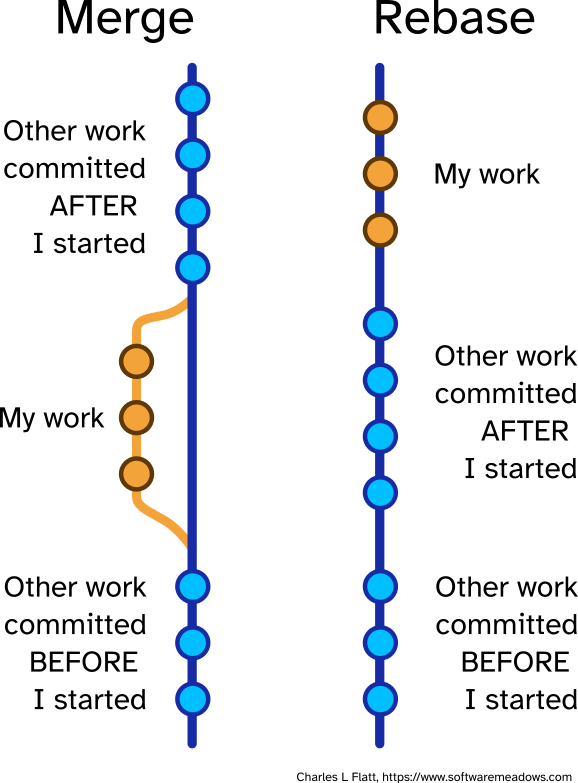

# Git: Comandos Esenciales y Flujos de Trabajo

## Introducción a las Ramas (Branches)

Una rama en Git es una línea independiente de desarrollo que permite trabajar en características, correcciones o experimentos sin afectar la rama principal (normalmente llamada "main" o "master"). Las ramas son referencias ligeras y móviles que apuntan a commits específicos.

### Comandos Básicos para Gestionar Ramas

#### `git branch`

**Explicación**: Este comando permite crear, listar y eliminar ramas en tu repositorio local.

**Caso de uso**: Quieres ver todas las ramas disponibles en tu repositorio.

```bash
$ git branch
* main
  feature-login
  bugfix-header
```

El asterisco (\*) indica la rama en la que te encuentras actualmente.

#### `git branch [nombre-rama]`

**Explicación**: Crea una nueva rama con el nombre especificado, pero no cambia a ella.

**Caso de uso**: Quieres crear una nueva rama para desarrollar una funcionalidad.

```bash
$ git branch prueba
$ git branch
* main
  prueba
  feature-login
```

Esto crea la rama "prueba" pero te mantiene en la rama actual (main).

#### `git checkout [nombre-rama]`

**Explicación**: Cambia de la rama actual a la rama especificada.

**Caso de uso**: Quieres moverte a la rama que acabas de crear para empezar a trabajar en ella.

```bash
$ git checkout prueba
Switched to branch 'prueba'
$ git branch
  main
* prueba
  feature-login
```

Ahora estás en la rama "prueba" y cualquier commit que hagas se aplicará a esta rama.

#### `git checkout -b [nombre-rama]`

**Explicación**: Crea una nueva rama y cambia a ella en un solo paso.

**Caso de uso**: Quieres crear una nueva rama y empezar a trabajar en ella inmediatamente.

```bash
$ git checkout -b feature-navbar
Switched to a new branch 'feature-navbar'
```

Este comando combina `git branch feature-navbar` y `git checkout feature-navbar` en uno solo.

## Fusionando Ramas (Merging)

Fusionar ramas es una operación fundamental en Git que permite integrar los cambios realizados en una rama con otra.

### Proceso de Fusión Básico

#### `git merge [nombre-rama]`

**Explicación**: Fusiona los cambios de la rama especificada en la rama actual.

**Caso de uso**: Has completado el desarrollo de una característica en una rama separada y ahora quieres incorporar esos cambios a la rama principal.

```bash
# Primero, asegúrate de estar en la rama destino (donde quieres recibir los cambios)
$ git checkout develop

# Asegúrate de tener la última versión de la rama develop
$ git pull

# Ahora, fusiona la rama de características en develop
$ git merge prueba

# Si todo va bien, puedes subir los cambios al repositorio remoto
$ git push
```

### Escenario Completo de Fusión

Vamos a ver un escenario completo de trabajo con ramas y fusiones:

1. **Crear y cambiar a una nueva rama para trabajar**:

    ```bash
    $ git checkout -b feature-login
    ```

2. **Realizar cambios y hacer commits**:

    ```bash
    # Editar archivos...
    $ git add .
    $ git commit -m "Implementar formulario de login"

    # Más cambios...
    $ git add .
    $ git commit -m "Añadir validación de formulario"
    ```

3. **Mientras tanto, la rama develop ha avanzado con cambios de otros desarrolladores**:

    ```bash
    # Actualizar la rama develop local
    $ git checkout develop
    $ git pull
    ```

4. **Volver a nuestra rama de características y traer los cambios de develop**:

    ```bash
    $ git checkout feature-login
    $ git merge develop
    ```

5. **Resolver conflictos si los hay**:
   Si Git no puede fusionar automáticamente, mostrará un mensaje de conflicto:

    ```bash
    Auto-merging login.js
    CONFLICT (content): Merge conflict in login.js
    Automatic merge failed; fix conflicts and then commit the result.
    ```

    Abre los archivos con conflictos, busca las marcas de conflicto (`>>>>>>`), edita para resolver y luego:

    ```bash
    $ git add login.js
    $ git commit -m "Resolver conflictos de merge con develop"
    ```

6. **Finalizar el desarrollo y fusionar con develop**:

    ```bash
    # Asegúrate de que todo funciona correctamente
    # Luego vuelve a develop y fusiona
    $ git checkout develop
    $ git merge feature-login
    $ git push
    ```

7. **Opcional: Eliminar la rama de características si ya no se necesita**:
    ```bash
    $ git branch -d feature-login
    ```

### Buenas Prácticas para Fusiones

1. **Siempre actualiza tu rama antes de fusionar**:

    ```bash
    $ git checkout develop
    $ git pull
    $ git checkout mi-rama
    $ git merge develop
    ```

2. **Resuelve los conflictos en tu rama de características**, no en la rama principal:

    ```bash
    # Estando en tu rama de características
    $ git merge develop
    # Resolver conflictos aquí
    ```

3. **Haz commits pequeños y significativos** para facilitar la resolución de conflictos.

4. **Recuerda este flujo de trabajo**:
    - Antes de subir "MI RAMA" a "DEVELOP":
    - Ve a "DEVELOP" y haz `git pull` por si hay cambios.
    - Vuelve a "MI RAMA" y haz `git merge "DEVELOP"`.
    - Comprueba que todo funcione.
    - Haz `git push` de "MI RAMA".
    - Ve a "DEVELOP" y haz `git merge` de "MI RAMA".
    - Haz `git push` de "DEVELOP" y ya puedes borrar tu rama.

## Profundizando en Git Reset

`git reset` es una herramienta poderosa para deshacer cambios y manipular el historial de commits. Hay tres modos principales de reset que afectan de manera diferente a tu repositorio.

### Los Tres Modos de Reset

#### `git reset --soft [commit]`

**Explicación**: Mueve el puntero HEAD al commit especificado, pero mantiene todos los cambios en el área de staging. Es como si hubieras preparado todos los cambios para un nuevo commit.

**Caso de uso**: Olvidaste añadir un archivo al último commit y quieres rehacerlo.

```bash
# Deshacer el último commit pero mantener los cambios en staging
$ git reset --soft HEAD~1

# Ahora puedes añadir el archivo olvidado
$ git add archivo-olvidado.js

# Y volver a hacer el commit con todos los archivos
$ git commit -m "Mensaje de commit completo"
```

#### `git reset --mixed [commit]` (modo por defecto)

**Explicación**: Mueve el puntero HEAD al commit especificado y deshace los cambios en el área de staging, pero mantiene las modificaciones en tu directorio de trabajo. Es el comportamiento predeterminado de `git reset`.

**Caso de uso**: Añadiste accidentalmente un archivo al área de staging que no quieres incluir en el próximo commit.

```bash
# Deshacer el staging de todos los archivos
$ git reset HEAD

# O deshacer el staging de un archivo específico
$ git reset HEAD archivo-no-deseado.js

# Verificar el estado
$ git status
```

#### `git reset --hard [commit]`

**Explicación**: Mueve el puntero HEAD al commit especificado, deshace los cambios en el área de staging Y elimina todos los cambios en el directorio de trabajo. Es potencialmente peligroso porque puedes perder trabajo no guardado.

**Caso de uso**: Has hecho cambios locales que quieres descartar completamente y volver al estado del último commit.

```bash
# ¡CUIDADO! Esto eliminará todos los cambios no guardados
$ git reset --hard HEAD

# O volver a un commit específico, descartando todos los commits posteriores
$ git reset --hard abc123
```

### Escenarios Prácticos de Reset

#### Escenario 1: Corregir el último commit

Has hecho un commit pero te das cuenta de que olvidaste incluir algunos cambios:

```bash
# Haces algunos cambios y los guardas
$ git add archivo1.js
$ git commit -m "Implementar funcionalidad X"

# ¡Oh no! Olvidaste incluir archivo2.js
# No hay problema, añádelo y usa --amend
$ git add archivo2.js
$ git commit --amend -m "Implementar funcionalidad X"
```

Alternativamente, usando reset:

```bash
# Deshacer el último commit manteniendo los cambios
$ git reset --soft HEAD~1

# Añadir todos los archivos necesarios
$ git add archivo1.js archivo2.js

# Volver a hacer el commit
$ git commit -m "Implementar funcionalidad X"
```

#### Escenario 2: Eliminar commits no deseados

Has hecho varios commits que prefieres no incluir en la historia del proyecto:

```bash
# Volver atrás 3 commits, descartando todos los cambios
$ git reset --hard HEAD~3

# O volver a un commit específico
$ git reset --hard abc123
```

#### Escenario 3: Limpiar el área de staging

Has añadido muchos archivos al área de staging pero quieres empezar de nuevo:

```bash
# Deshacer todos los cambios en staging pero mantener las modificaciones
$ git reset

# Verificar el estado
$ git status
```

### Recuperación después de un reset --hard

Si has ejecutado un `git reset --hard` y te arrepientes, aún hay esperanza. Git mantiene un registro de todas las acciones en el "reflog":

```bash
# Ver el historial de acciones
$ git reflog

# Ejemplo de salida:
# abc123 HEAD@{0}: reset: moving to HEAD~3
# def456 HEAD@{1}: commit: Mensaje del commit perdido
# ...

# Recuperar el estado anterior al reset
$ git reset --hard def456
```

## Rebase: Una Alternativa a Merge

`git rebase` es una forma alternativa de integrar cambios entre ramas. A diferencia de `merge`, que crea un nuevo commit de fusión, `rebase` reescribe el historial de commits para crear una línea de tiempo lineal.

### Concepto Básico de Rebase

**Explicación**: Rebase toma los commits de una rama y los "replanta" sobre la punta de otra rama, creando una historia lineal sin commits de fusión.

**Caso de uso**: Quieres integrar los últimos cambios de la rama principal en tu rama de características, pero manteniendo un historial limpio y lineal.

```bash
# Estando en tu rama de características
$ git checkout feature-auth

# Rebase sobre la rama principal
$ git rebase main
```

### Rebase Interactivo

**Explicación**: El rebase interactivo permite modificar, reordenar, combinar o eliminar commits durante el proceso de rebase.

**Caso de uso**: Quieres limpiar tu historial de commits antes de fusionar tu rama con la principal.

```bash
# Rebase interactivo de los últimos 3 commits
$ git rebase -i HEAD~3
```

Esto abrirá un editor con opciones para cada commit:

```
pick abc123 Primer commit
pick def456 Segundo commit
pick ghi789 Tercer commit

# Comandos disponibles:
# p, pick = usar commit
# r, reword = usar commit, pero editar el mensaje
# e, edit = usar commit, pero detener para modificar
# s, squash = usar commit, pero fusionar con el anterior
# f, fixup = como "squash", pero descartar el mensaje
# d, drop = eliminar commit
```

Puedes cambiar "pick" por cualquiera de estas opciones, guardar y cerrar el editor para que Git ejecute las acciones especificadas.

### Merge vs. Rebase: ¿Cuándo usar cada uno?

#### Usa Merge cuando:

-   Quieres preservar el historial exacto de lo que sucedió.
-   Estás fusionando ramas públicas (que otros desarrolladores usan).
-   Necesitas resolver conflictos una sola vez.

#### Usa Rebase cuando:

-   Quieres un historial de proyecto limpio y lineal.
-   Estás trabajando en una rama local que solo tú usas.
-   Prefieres resolver conflictos commit por commit.
-   Quieres asegurarte de que tus commits se aplican limpiamente sobre la rama principal.

### Flujo de Trabajo con Rebase

1. **Crear una rama para una nueva característica**:

    ```bash
    $ git checkout -b feature-auth
    ```

2. **Realizar cambios y hacer commits**:

    ```bash
    # Varios commits...
    ```

3. **Mientras tanto, la rama principal ha avanzado. Actualiza tu rama con rebase**:

    ```bash
    # Primero, actualiza tu rama principal
    $ git checkout main
    $ git pull

    # Vuelve a tu rama y haz rebase
    $ git checkout feature-auth
    $ git rebase main
    ```

4. **Resolver conflictos si los hay**:
   Durante el rebase, Git se detendrá en cada commit que cause conflictos:

    ```bash
    # Git mostrará algo como:
    # CONFLICT (content): Merge conflict in auth.js
    # Fix conflicts and then run "git rebase --continue"

    # Edita los archivos para resolver los conflictos
    $ git add auth.js
    $ git rebase --continue
    ```

    Si decides que es demasiado complicado, puedes abortar:

    ```bash
    $ git rebase --abort
    ```

5. **Limpiar tu historial con rebase interactivo antes de fusionar**:

    ```bash
    $ git rebase -i HEAD~5  # Para los últimos 5 commits

    # En el editor, combina commits relacionados:
    pick abc123 Añadir formulario de autenticación
    squash def456 Corregir estilo del formulario
    squash ghi789 Añadir validación al formulario
    pick jkl012 Implementar lógica de autenticación
    ```

6. **Finalmente, fusionar con la rama principal**:
    ```bash
    $ git checkout main
    $ git merge feature-auth  # Será un merge fast-forward si has hecho rebase
    ```

### Advertencias sobre Rebase

1. **Nunca hagas rebase de ramas públicas** que otros desarrolladores están usando.
2. **Rebase reescribe el historial**, lo que puede causar problemas si los commits ya se han compartido.
3. Si has publicado tu rama y luego haces rebase, necesitarás usar `git push --force` para actualizar el repositorio remoto, lo cual puede causar problemas para otros desarrolladores.

## Comandos Adicionales Importantes

### `git pull`

**Explicación**: Actualiza tu rama local con los cambios del repositorio remoto. Es una combinación de `git fetch` (descarga cambios) y `git merge` (integra cambios).

La diferencia principal entre `git pull` y `git fetch` radica en cómo manejan la integración de cambios del repositorio remoto:

`git fetch` descarga los cambios del repositorio remoto pero no los integra automáticamente en tu rama de trabajo local. Simplemente actualiza tu copia local del repositorio remoto, permitiéndote ver qué cambios se han realizado sin modificar tu trabajo actual. Es como decir "muéstrame qué ha cambiado, pero no toques mi código".

`git pull`, por otro lado, es una combinación de dos operaciones: primero ejecuta `git fetch` para descargar los cambios del repositorio remoto, y luego automáticamente ejecuta `git merge` para integrar esos cambios en tu rama de trabajo actual. Es como decir "trae los cambios y aplícalos a mi código".

En términos prácticos:

-   Usa `git fetch` cuando quieras ver qué cambios existen sin afectar tu trabajo actual
-   Usa `git pull` cuando estés listo para incorporar los cambios remotos a tu trabajo

`git pull` es más conveniente para uso diario, pero `git fetch` ofrece más control sobre cuándo y cómo integrar los cambios.

**Caso de uso**: Antes de empezar a trabajar cada día, quieres asegurarte de tener la última versión del código.

```bash
$ git pull origin main
```

### `git push`

**Explicación**: Envía tus commits locales al repositorio remoto.

**Caso de uso**: Has completado una característica y quieres compartirla con el equipo.

```bash
# Enviar cambios de la rama actual
$ git push origin feature-auth

# Si la rama no existe en el remoto, puedes configurarla
$ git push -u origin feature-auth
```

### `git stash`

**Explicación**: Guarda temporalmente los cambios no guardados para que puedas cambiar de rama sin hacer commit.

**Caso de uso**: Estás trabajando en algo pero necesitas cambiar rápidamente a otra rama para una corrección urgente.

```bash
# Guardar cambios actuales
$ git stash

# Cambiar de rama y hacer lo necesario
$ git checkout hotfix
# ... trabajo en la corrección ...
$ git commit -m "Corregir error crítico"
$ git push

# Volver a tu rama original y recuperar los cambios
$ git checkout feature-auth
$ git stash pop
```

### `git log`

**Explicación**: Muestra el historial de commits.

**Caso de uso**: Quieres ver qué cambios se han realizado recientemente.

```bash
# Ver historial básico
$ git log

# Ver historial con formato resumido
$ git log --oneline

# Ver historial con gráfico de ramas
$ git log --graph --oneline --all
```

## Resumen de Flujos de Trabajo

### Flujo de Trabajo con Merge

1. Crea una rama para tu característica: `git checkout -b feature`
2. Realiza cambios y haz commits
3. Actualiza tu rama con los cambios de la rama principal:
    ```bash
    git checkout main
    git pull
    git checkout feature
    git merge main
    ```
4. Resuelve conflictos si los hay
5. Completa tu característica y fusiona con la rama principal:
    ```bash
    git checkout main
    git merge feature
    git push
    ```

### Flujo de Trabajo con Rebase

1. Crea una rama para tu característica: `git checkout -b feature`
2. Realiza cambios y haz commits
3. Actualiza tu rama con los cambios de la rama principal:
    ```bash
    git checkout main
    git pull
    git checkout feature
    git rebase main
    ```
4. Resuelve conflictos si los hay
5. Opcionalmente, limpia tu historial: `git rebase -i HEAD~n`
6. Completa tu característica y fusiona con la rama principal:
    ```bash
    git checkout main
    git merge feature  # Será un fast-forward merge
    git push
    ```

## Consejos Finales

1. **Haz commits pequeños y frecuentes** con mensajes descriptivos.
2. **Actualiza tu rama regularmente** con los cambios de la rama principal.
3. **Resuelve los conflictos en tu rama**, no en la rama principal.
4. **Prueba tus cambios después de resolver conflictos** antes de hacer push.
5. **Usa `git status` frecuentemente** para entender el estado actual de tu repositorio.
6. **Aprende a usar `git reflog`** para recuperarte de errores.
7. **Considera usar herramientas gráficas** como GitKraken, SourceTree o la extensión de Git para VS Code si prefieres una interfaz visual.

---


